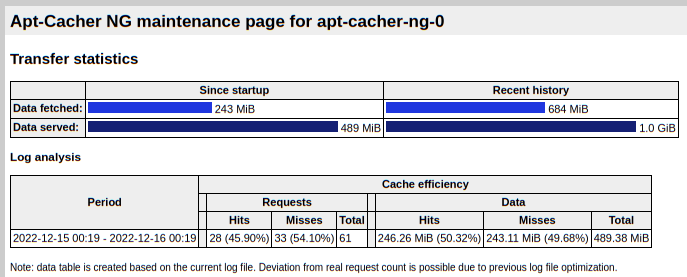

# Apt-Cacher NG caching proxy for package files from Linux distributors

[Return to Application List](../../)

* Helm based ArgoCD application deployment
* Deployed as a Statefulset
* Allows customized configuration file via configMap

Review file `apt-cacher-ng-argocd-helm/applications/apt-cacher-ng.yaml`

* Define the ArgoCD project to assign this application to
* ArgoCD uses `default` project by default

  ```yaml
  spec:
    project: default
  ```

* Define Persistent Storage for Apt-Cacher NG

  ```yaml
  persistence:
    cache-vol:
      enabled: true
      mountPath: /var/cache/apt-cacher-ng
      # type: pvc
      type: emptyDir
      accessMode: ReadWriteOnce
      size: 10Gi
      retain: true
      # storageClass: freenas-iscsi-csi
      # existingClaim:
      # volumeName:
  ```

  * Change `type` to `pvc` and then specify the `storageClass` to use.
  * `existingClaim` and `volumeName` can be used to reused an existing PVC claim you may already have.

* Service type is `LoadBalancer` and a specific IP Address SHOULD be defined from your pool of LoadBalancer IP Addresses.  This IP address will be used by `apt` clients and it should not change.

  ```yaml
    service:
      main:
        enabled: true
        primary: true
        type: LoadBalancer
        # loadBalancerIP: 192.168.10.221
        ports:
          http:
            enabled: true
            port: 3142
            protocol: TCP
            targetPort: 3142
  ```

* The `ingress` middleware reference points to the Traefik CRD which provides basic authentication and the middleware needed to access the `Apt-Cacher NG` maintenance page:

  ```yaml
    ingress:
      main:
        enabled: true
        primary: true
        annotations:
          traefik.ingress.kubernetes.io/router.entrypoints: "websecure"
          traefik.ingress.kubernetes.io/router.middlewares: "traefik-traefik-basic-auth@kubernetescrd,traefik-x-forward-https-headers@kubernetescrd,traefik-compress@kubernetescrd"
        hosts:
          - host: apt-cacher-ng.example.com
            paths:
              - path: /
                pathType: Prefix
  ```

You can access the APT-Cacher NG maintenance page by the Traefik ingress defined above `https://apt-cacher-ng.example.com/acng-report.html`



* You can customize the Apt-Cacher NG configuration file within the `configmap` section.  This is not the entire default configuration file, only the changes from the default values are needed.

  ```yaml
    configmap:
      acng-conf-file:
        enabled: true
        data:
          acng.conf: |
            # Storage directory for downloaded data and related maintenance activity.
            #
            # Note: When the value for CacheDir is changed, change the file
            # /lib/systemd/system/apt-cacher-ng.service too
            #
            CacheDir: /var/cache/apt-cacher-ng

            # Log file directory, can be set empty to disable logging
            #
            LogDir: /var/log/apt-cacher-ng

            ...
  ```

---

## Client Configuration

Debian / Ubuntu clients need to be made aware of the proxy.  There are several ways to do this.  See [project documentation](https://wiki.debian.org/AptCacherNg#Clients) for details.

The easiest way is to just manually define the proxy reference pointing to the IP address of the LoadBalancer you defined:

```shell
$ cat /etc/apt/apt.conf.d/01proxy

Acquire::http::Proxy "http://192.168.10.221:3142";
Acquire::https::Proxy "false";
```

* NOTE: notice `https` repositories are not cached directly.  However, you can format your `https` repositories to be `http` to Apt-Cacher NG and then Apt-Cacher NG will use `https` to fetch packages over `https`.  You would need to change your repositories to look like:

```text
# deb https://baltocdn.com/helm/stable/debian all main
deb http://HTTPS///baltocdn.com/helm/stable/debian/ all main
```

* See Project Documentation [8.3 Access to SSL/TLS remotes (HTTPS)](https://www.unix-ag.uni-kl.de/~bloch/acng/html/howtos.html#ssluse) "tell-me-what-you-need method" for explanation of how it works.

---

## Shell Access to APT-Cacher NG

You can easily access the APT-Cacher NG container shell.  Below shows an example of browsing where the cached files are stored:

```shell
$ kubectl exec -it pod/apt-cacher-ng-0 -n apt-cacher-ng -- /bin/bash

root@apt-cacher-ng-0:/# cd /var/cache/apt-cacher-ng/

root@apt-cacher-ng-0:/var/cache/apt-cacher-ng# ls -l
total 35
drwxr-xr-x 4 apt-cacher-ng apt-cacher-ng 4 Dec 14 12:32 _xstore
drwxr-xr-x 3 apt-cacher-ng apt-cacher-ng 3 Dec 14 13:02 security.ubuntu.com
drwxr-xr-x 4 apt-cacher-ng apt-cacher-ng 4 Dec 14 13:12 uburep

```

[Return to Application List](../../)
