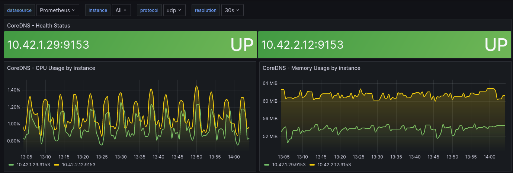

# CoreDNS Linear Autoscaler - based on Cluster Nodes or Cluster Cores

K3s by default installs CoreDNS via Deployment using a single Replica (1 instance).  This is fine for a handful of nodes, but as the number of nodes increase you will want additional CoreDNS instances even if just for some redundancy.

IMPORTANT: _This does not install or alter the CoreDNS configuration. CoreDNS must already be installed.  This just adjusts the ReplicaSize of the existing deployment based on cluster size._

This chart uses the [Cluster Proportional Autoscaler](https://github.com/kubernetes-sigs/cluster-proportional-autoscaler) to monitor and adjust ReplicaSet.  

[Return to Application List](../../)

---

* Helm based ArgoCD application deployment
* No persistent storage required
* Default is minimum of 2 CoreDNS instances
* For every 8 nodes an instance is added
* For every 64 cores an instance is added

---

Review file `coredns-autoscaler-argocd-helm/applications/coredns-autoscaler.yaml`

* Define the ArgoCD project to assign this application to
* ArgoCD uses `default` project by default

  ```yaml
  spec:
    project: default
  ```

* This ArgoCD application defaults to the `proportional-autoscaler` namespace.  To use an alternative namespace update:

  ```yaml
  destination:
    server: https://kubernetes.default.svc
    namespace: proportional-autoscaler
  ```

  * And update file
Review file `coredns-autoscaler-argocd-helm/namespaces/proportional-autoscaler.yaml` to match:

  ```yaml
  ---
  apiVersion: v1
  kind: Namespace
  metadata:
    name: proportional-autoscaler
  ```

---

Review file `coredns-autoscaler-argocd-helm/workloads/coredns-autoscaler/values.yaml`

* The `config` sections defines how CoreDNS will be scaled based on the size of the cluster.

  ```yaml
  config:
    linear:
      coresPerReplica: 64
      nodesPerReplica: 8
      min: 2
      max: 10
      preventSinglePointFailure: true
  ```

  * Minimum of 2 CoreDNS instances (max of 10)
  * For every 8 nodes an instance is added
  * For every 64 cores an instance is added
    * If the number of cores divided by 64 or the number of nodes divided by 8 is higher than the minimum of 2 then that number of Replicas will be used.

* The `options` sections defined where the CoreDNS deployment is located.

  ```yaml
  options:
    namespace: kube-system
    target: deployment/coredns
  ```

---

## Prior to Deployment of CoreDNS Autoscaler

```shell
$ kubectl get deployment.apps/coredns -n kube-system

NAME      READY   UP-TO-DATE   AVAILABLE   AGE
coredns   1/1     1            1           582d

```

* Only single instance used

## After Deployment of CoreDNS Autoscaler

CoreDNS Autoscaler scaled the Replica to the minimum of 2 for my 6 node cluster size:

```shell
$ kubectl get deployment.apps/coredns -n kube-system

NAME      READY   UP-TO-DATE   AVAILABLE   AGE
coredns   2/2     2            2           582d
```

```shell
$ kubectl get pods -n kube-system -l k8s-app=kube-dns

NAME                      READY   STATUS    RESTARTS   AGE
coredns-8b9777675-kfnxb   1/1     Running   0          26d
coredns-8b9777675-qkt5p   1/1     Running   0          80m
```

---

The Grafana Dashboard for CoreDNS picked up the additional instance:



[Return to Application List](../../)
