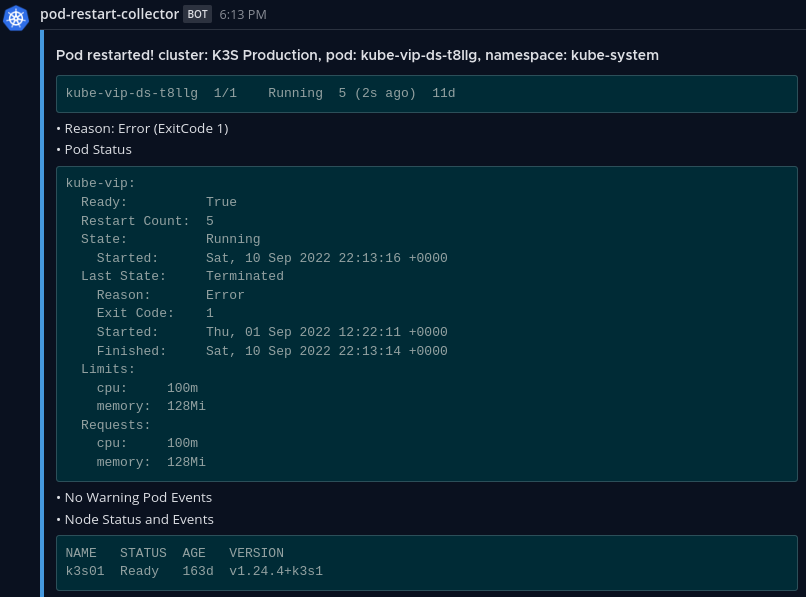
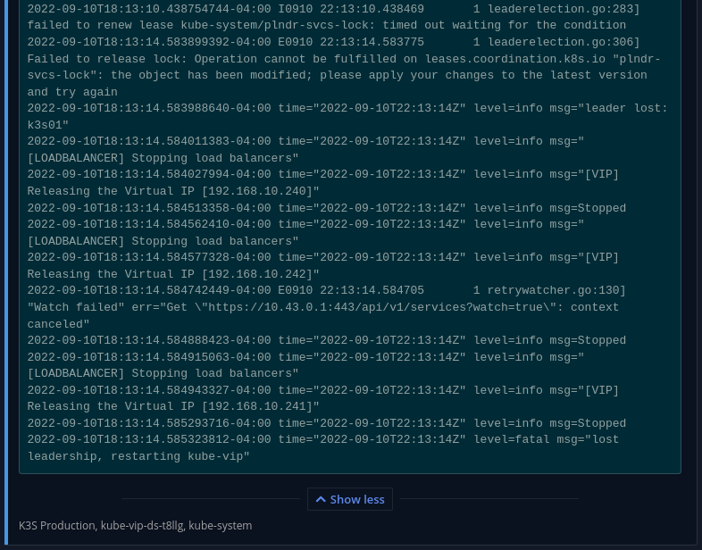

# K8s Pod Restart Info Collector - Slack Notifications on Pod Restart

[Return to Application List](../../)

* Can send notifications to any Slack compatible webhook such as Mattermost
* Helm based ArgoCD application deployment
* Does not require any PVC storage
* Does not support a predefined secret, don't save this in a public ArgoCD repository

Review file `pod-restart-info-collector/applications/pod-restart-info-collector.yaml`

* Define the ArgoCD project to assign this application to
* ArgoCD uses `default` project by default

  ```yaml
  spec:
    project: default
  ```

* Set the initial image version (includes a Renovate hint to monitor and update tag)

  ```yaml
    image:
      repository: devopsairwallex/k8s-pod-restart-info-collector
      # renovate: datasource=docker devopsairwallex/k8s-pod-restart-info-collector
      tag: "v1.0.0"
  ```

* Define Slack WebHook Connection

  ```yaml
      # clusterName: "gtpn-prod-sg"
      # slackWebhookUrl: "https://hooks.slack.com/services/xxxxxx"
      slackChannel: "restart-info-nonprod"
      slackUsername: "k8s-pod-restart-info-collector"
      muteSeconds: 600
  ```

  * See [Project Github Page](https://github.com/airwallex/k8s-pod-restart-info-collector) for additional details on values
  * Uncomment and set `clusterName` which can be any value, used in messages only
  * Uncommnet and set `slackWebhookURL` to the value appropriate for your Slack setup
    * Works well with other Slack compatible Webhooks such as Mattermost
    * In your Slack setup define a custom emoji for `:kubernetes:` and that image will be associated to the message
  * Set `slackChannel` to the channel to post messages
  * Set `slackUsername` to the name to post messages as
  * Set `muteSeconds` to duration to mute duplicate alerts

* Default Project resources seemed excessive on my testing, I reduced them a bit:

  ```yaml
      resources: 
        limits:
          cpu: 40m
          memory: 50Mi
        requests:
          cpu: 10m
          memory: 15Mi
  ```

---

Once configured and deployed, the pod log will be fairly simple:

```log
I0911 14:42:22.081691       1 slack.go:58] Slack Info: channel: pod-restart-collector, username: pod-restart-collector, clustername: K3S Production, muteseconds: 600
I0911 14:42:22.179960       1 controller.go:91] Starting controller
```

Upon detecting a pod restart, you will get a notification to the Slack configuration defined.  Below shows a Slack compatible alternative called Mattermost posting the alert:



Detailed logs before the Pod restart are included in the alert, tail end of the logs from this alert shown below:



[Return to Application List](../../)
