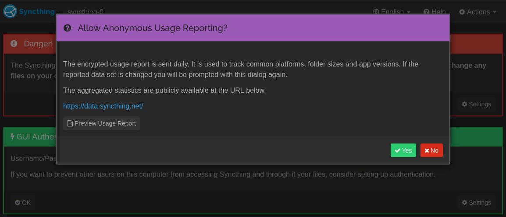
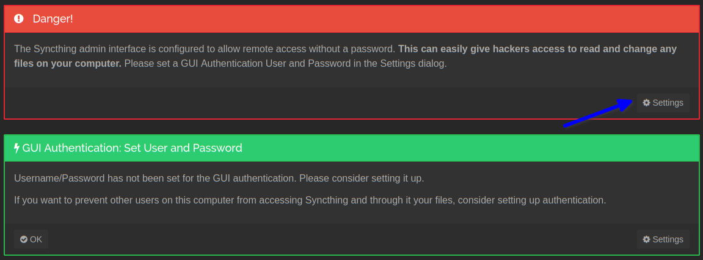
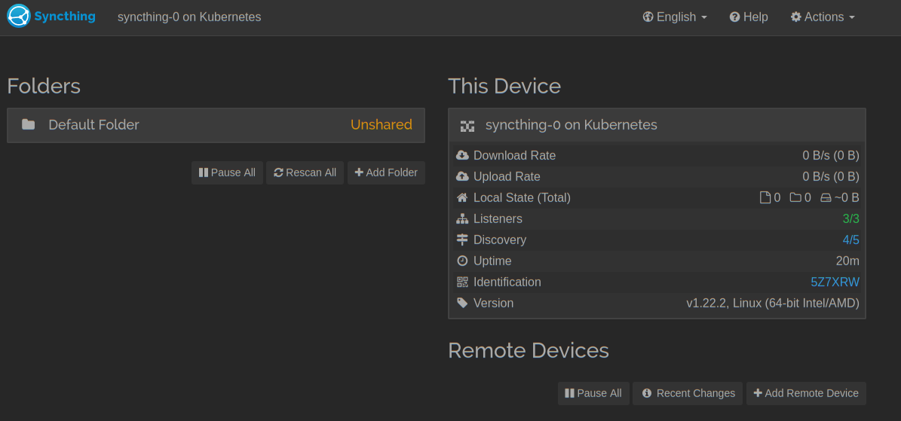
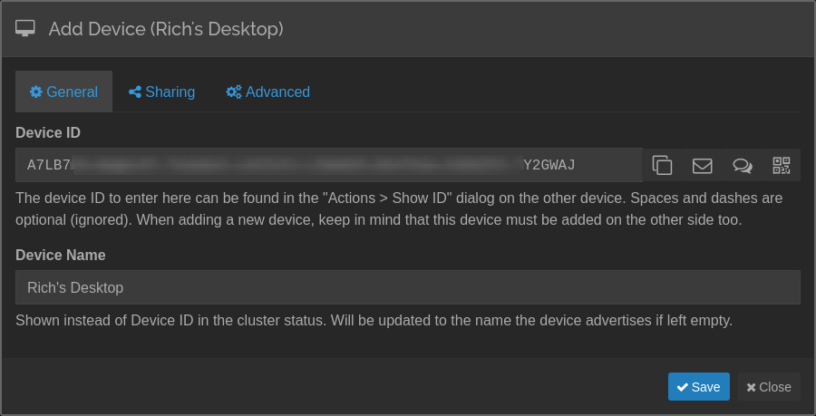
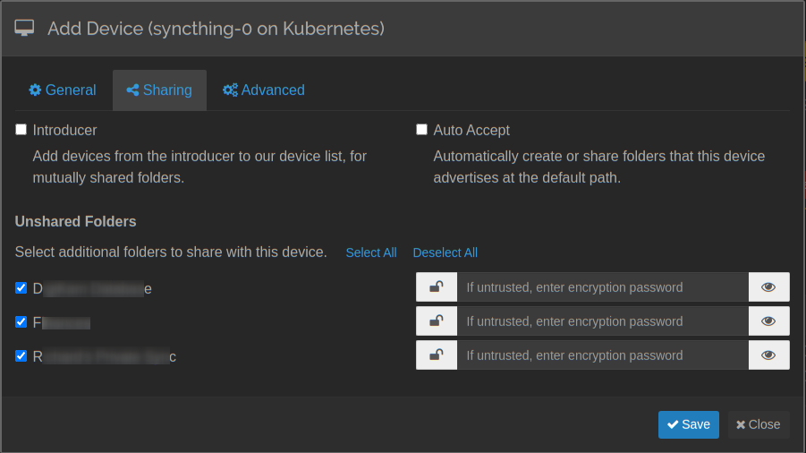
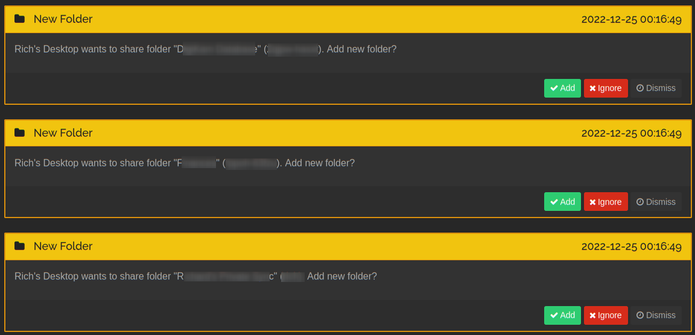
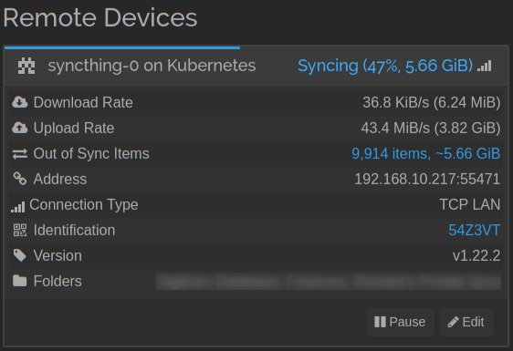

# Syncthing - a continuous file synchronization program

It synchronizes files between two or more computers in real time, safely protected from prying eyes.

[Return to Application List](../../)

* Helm based ArgoCD application deployment
* Deployed as a Statefulset

Review file `syncthing-argocd-helm/applications/syncthing.yaml`

* Define the ArgoCD project to assign this application to
* ArgoCD uses `default` project by default

  ```yaml
  spec:
    project: default
  ```

* Define Persistent Storage for Syncthing:

  ```yaml
  # Data and configuration stored here
  persistence:
    data:
      enabled: true
      mountPath: /var/syncthing
      # type: pvc
      type: emptyDir
      accessMode: ReadWriteOnce
      size: 50Gi
      retain: true
      # storageClass: ceph-block
      # existingClaim:
      # volumeName:
  ```

  * Change `type` to `pvc` and then specify the `storageClass` to use.
  * `existingClaim` and `volumeName` can be used to reused an existing PVC claim you may already have.

* The service `main` is used to access the Syncthing Admin GUI.  This will be used by the `ingress` (see below).

  ```yaml
  service:
    main:
      enabled: true
      ports:
        http:
          port: 8384
  ```

  * No changes are needed for this service.

* The service `listen` is type `LoadBalancer` and a specific IP Address SHOULD be defined from your pool of LoadBalancer IP Addresses.  This IP address will be used by `Syncthing` clients and it should not change.

  ```yaml
    listen:
      enabled: true
      type: LoadBalancer
      # loadBalancerIP: 192.168.10.221
      externalTrafficPolicy: Local
  ```

  * NOTE: The `listen` and `discovery` ports have been put on the same LoadBalancer as modern Kubernetes versions support multi-protocol load balancers.

* The `ingress` middleware reference points to the Traefik CRD without basic authentication as Syncthing provides its own authentication:

  ```yaml
    ingress:
      main:
        enabled: true
        annotations:
          traefik.ingress.kubernetes.io/router.entrypoints: "websecure"
          traefik.ingress.kubernetes.io/router.middlewares: "traefik-x-forward-https-headers@kubernetescrd,traefik-compress@kubernetescrd"
        hosts:
          - host: syncthing.example.com
            paths:
              - path: /
                pathType: Prefix
  ```

* You can access the Syncthing Administrative GUI page by the Traefik ingress defined above `https://syncthing.example.com/`

---

## Initial Configuration

Upon first connecting you will need to perform the initial configuration.

### Anonymous Usage Reporting Option



* You need to decide if you want to send the Syncthing project usage information about how you use Syncthing. Answer by clicking `[Yes]` or `[No]` buttons.

### Administrative Authentication

Next you will get this scary prompt to configure authentication for the Administrative GUI.



* Click the `[Settings]` button as indicated.

  * On `[General Settings]` Tab:
    * Set Device name that makes sense I use `syncthing-0 on Kubernetes`.
    * Minimum Free Space bump to at least `5%`.
    * For the API Key, click `[Generate]` button a few times as you don't want whatever the default one is.
  * On `[GUI]` Tab:
    * Enter your "GUI Athentication User".
    * Enter your "GUI Authentication Password".
    * DO NOT Enable "Use HTTPS for GUI" as Traefik is already providing HTTPS certificate for the GUI.
    * Choose which GUI Theme to use such as "Dark".
    * Click the "[Save]" button.

You will not have a normal GUI ready to add clients.



### Configure Clients

On each of your Syncthing clients, open the local GUI.

* Under `Actions` select `Show ID`.
* Copy the very long ID Shown (not the QR Code).

On the Syncthing Server deployed on Kubernetes:

* Click `[+ Add Remote Device]` button.



* Cut & Paste the long ID of the Client to `Device ID`.
* Optionally provide a descriptive name of the device.
* Click the `[Save]` button.

Back on the client you should now have a notice about the server trying to connect:


* Click `[+ Add Device]` button to accept the connection.

On the next dialog select `[Sharing Tab]` and enable which of your shared folders you want to sync with the server:



* Click `[Save]` button to start enable folder sync.

On the Syncthing Server deployed on Kubernetes, you will have a popup notice for each of the folders requested to be pushed to the server:



* For each of the requested folders you will click the `[Add]` button.

On the Add Folder Dialog:


* Make sure this is within `/var/syncthing` directory structure. This is the directory of the persistent storage (PVC).
* Review the various folder options and click `[Save]` button.

Immediately the Client will start syncing to the server:



Once completed, move on to your next client.

[Return to Application List](../../)
