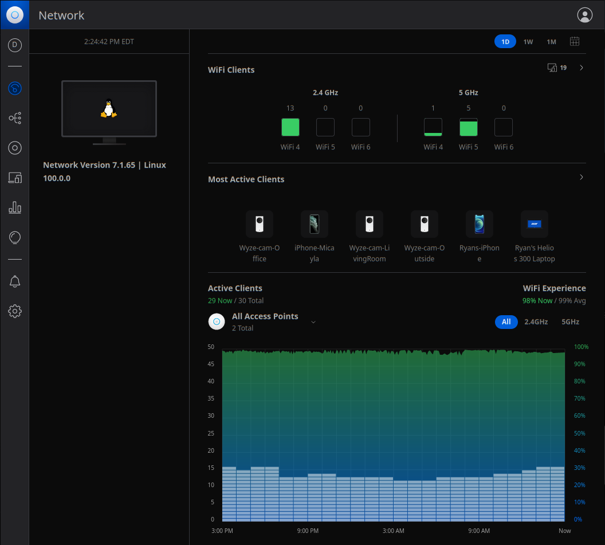

# Unifi Controller Wireless Network Management Software from Ubiquiti

* Be sure to export a backup from your existing installation.  You will be able to import that backup into this installation.

[Return to Application List](../../)

* Helm based ArgoCD application deployment
* Much simpler to configure than the Kustomize version
* Uses 10 GiB Persistent Volume Storage

Review file `unifi-controller-argocd-helm/applications/unifi.yaml`

* Define the ArgoCD project to assign this application to
* ArgoCD uses `default` project by default

  ```yaml
  spec:
    project: default
  ```

* Define Time Zone to use

  ```yaml
    env:
      TZ: "America/New York"
  ```

* Define Ingress Name, below uses "unifi.example.com"

  ```yaml
    ingress:
      main:
        enabled: true
        annotations:
          traefik.ingress.kubernetes.io/router.entrypoints: "websecure"
          traefik.ingress.kubernetes.io/router.middlewares: "traefik-compress@kubernetescrd"
        hosts:
          - host: unifi.example.com
            paths:
              - path: /
                pathType: Prefix
  ```

  * Annotation added to use SSL (websecure) port
  * Annotation added to use compression middleware

* Define Persistent Storage
  * Storage needs to be large enough to hold Unifi Controller own internal database, backups and historical data
  * A 10 Gib Persistent volume mounted at `/unfi` is created

  ```yaml
    persistence:
      config:
        enabled: true
        type: pvc
        mountPath: /unifi
        accessMode: ReadWriteOnce
        size: 10Gi
        retain: true
  ```

* Service type is `LoadBalancer` and specific IP Address can be defined

  ```yaml
    service:
      main:
        enabled: true
        type: LoadBalancer
        loadBalancerIP: 192.168.10.242
  ```

---

Note the Unifi Controller application can take several minutes to become ready.  Getting a `Bad Gateway` message after installation or upgrade is normal.  Monitor the container logs to see when it is ready, or just try again in a few minutes.

---
First time connecting should show this screen:


From here you can restore your configuration from a backup or start building your network from scratch.  

* NOTE if you had to change the name or IP Address of your controller to get it working on Kubernetes, then will need to use your existing (old) UniFi Controller to push a configuration change to all your devices to tell them to start reporting to your new controller.

One all the kinks are worked out, your network devices will start reporting in:



[Return to Application List](../../)
