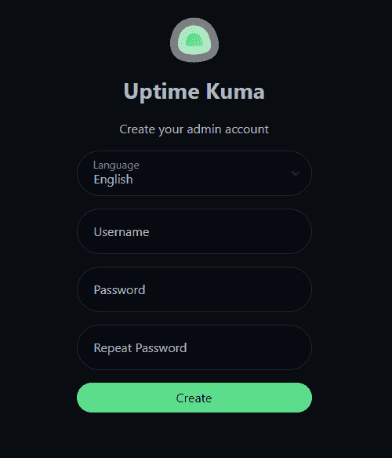

# Uptime Kuma - A self-hosted monitoring tool

[Return to Application List](../../)

* Helm based ArgoCD application deployment
* Based on [Bernd Schorgers](https://bjw-s.github.io/helm-charts/docs/) standard `app-template` which replaces the deprecated [k8s@home](https://github.com/k8s-at-home/charts) common template
* Deployed as a Statefulset with a 4 GB Persistent Storage Volume for configuration

Review file `uptime-kuma-argocd-helm/applications/uptime-kuma.yaml`

* Define the ArgoCD project to assign this application to
* ArgoCD uses `default` project by default

  ```yaml
  spec:
    project: default
  ```

* The source repository URL specifies the version of the `app-template` as well as the path within your GitHub repository for location of the `values.yaml`:

  ```yaml
    - repoURL: https://bjw-s.github.io/helm-charts
      chart: app-template
      targetRevision: 1.5.0
      helm:
        valueFiles:
          - $values/workloads/uptime-kuma/values.yaml
  ```

* The `$values` variable defines your GitHub repository. Set your `USER_NAME` and `REPO_NAME`.

  ```yaml
    - repoURL: 'https://github.com/<USER_NAME>/<REPO_NAME>.git'
      targetRevision: HEAD
      ref: values
  ```

* Define the namespace to deploy to, this defaults to `uptime-kuma`.

  ```yaml
  destination:
    server: https://kubernetes.default.svc
    namespace: uptime-kuma
  ```

---

Uptime Kuma provides its own authentication. The first user who logs in will be the administrator account.  No kubernetes secret is used for this account.

---

Review file `uptime-kuma-argocd-helm/workloads/uptime-kuma/values.yaml`

The `env` values Uptime Kuma uses can be defined here.

  ```yaml
  env:
    TZ: America/New_York
    UPTIME_KUMA_PORT: &port 3001
  ```

* The default container `port` used is `3001`.

---

* The `ingress` middleware reference points to the Traefik CRDs for X-Forwarding HTTPS Heads and enabling compression.  Uptime Kuma provides its own authentication.

  ```yaml
  ingress:
    main:
      enabled: true
      annotations:
        traefik.ingress.kubernetes.io/router.entrypoints: "websecure"
        traefik.ingress.kubernetes.io/router.middlewares: "traefik-x-forward-https-headers@kubernetescrd,traefik-compress@kubernetescrd"
      hosts:
        - host: &host uptime.example.com
          paths:
            - path: /
              pathType: Prefix
  ```

---

* For Persistent Storage a default of 4 Gib is used. This is probably on the high side for a SQLite database. By default Uptime Kuma will purge data beyond 180 days.

  * Adjust the `storageClass` to your needs.

  ```yaml
  persistence:
    data:
      enabled: true
      mountPath: /app/data
      type: pvc
      accessMode: ReadWriteOnce
      size: 4Gi
      retain: true
      storageClass: ceph-block
      # volumeName:
  ```

---

Upon your first login to the web interface, you will create the admin account:



Once you have logged in follow the standard guides on using Uptime Kuma.

[Return to Application List](../../)
