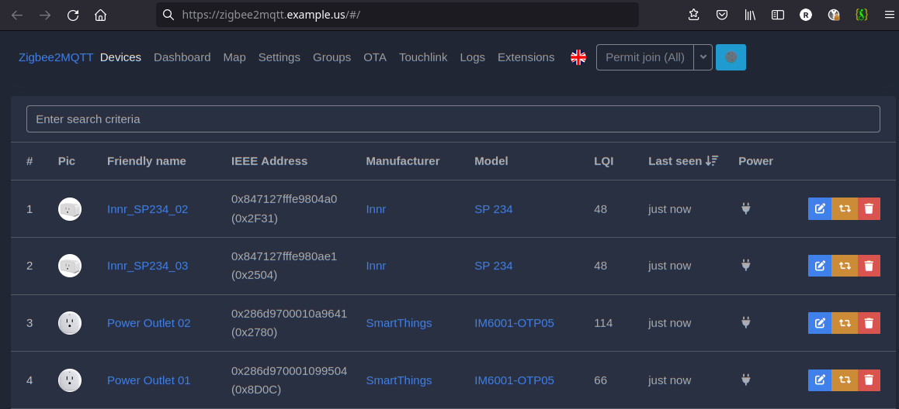
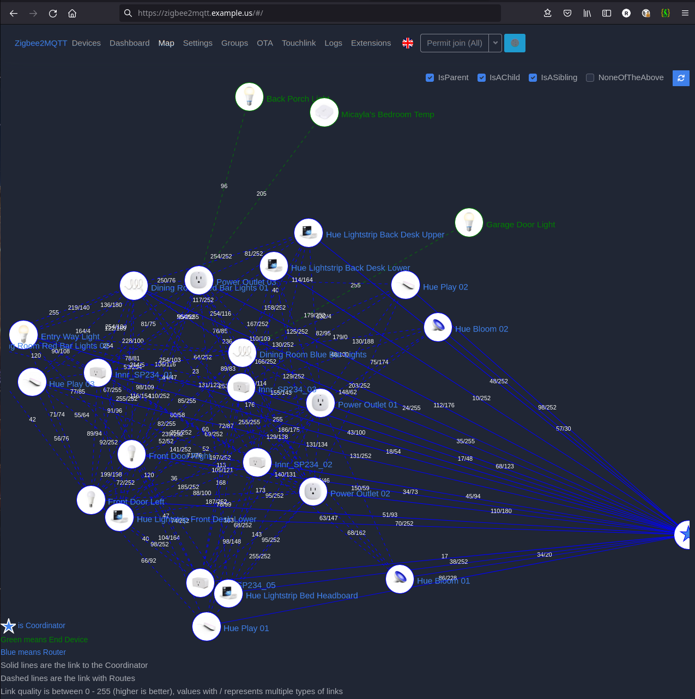

# Zigbee2MQTT - Zigbee to MQTT Bridge

[Return to Application List](../../)

* Helm based ArgoCD application deployment
* Based on [Bernd Schorgers](https://bjw-s.github.io/helm-charts/docs/) standard `app-template` which replaces the deprecated [k8s@home](https://github.com/k8s-at-home/charts) common template
* Deployed as a Statefulset with a 100Mi Persistent Storage Volume for configuration

Review file `zigbee2mqtt-argocd-helm/applications/zigbee2mqtt.yaml`

* Define the ArgoCD project to assign this application to
* ArgoCD uses `default` project by default

  ```yaml
  spec:
    project: default
  ```

* The source repository URL specifies the version of the `app-template` as well as the path within your GitHub repository for location of the `values.yaml`:

  ```yaml
    - repoURL: https://bjw-s.github.io/helm-charts
      chart: app-template
      targetRevision: 1.5.0
      helm:
        valueFiles:
          - $values/workloads/zigbee2mqtt/values.yaml
  ```

* The `$values` variable defines your GitHub repository. Set your `USER_NAME` and `REPO_NAME`.

  ```yaml
    - repoURL: 'https://github.com/<USER_NAME>/<REPO_NAME>.git'
      targetRevision: HEAD
      ref: values
  ```

* Define the namespace to deploy to, this defaults to `mosquitto`.

  ```yaml
  destination:
    server: https://kubernetes.default.svc
    namespace: mosquitto
  ```

---

Review file `zigbee2mqtt-argocd-helm/workloads/zigbee2mqtt/values.yaml`

Most of the `env` values defined for Zigbee2mqtt are reasonable defaults. See [Project Documentation](https://www.zigbee2mqtt.io/guide/configuration/) for details. You *WILL* need to set the following for your environment:

* Define the URL to access the frontend GUI:

  ```yaml
  ZIGBEE2MQTT_CONFIG_FRONTEND_URL: https://zigbee2mqtt.example.com
  ```

* Set the service name of your Mosquitto MQTT Broker:

  ```yaml
  ZIGBEE2MQTT_CONFIG_MQTT_SERVER: mqtt://mosquitto-mqtt.mosquitto
  ```

* The MQTT base topic default is good for most installs.  However, if you need multiple Zigbee2mqtt instances running, perhaps using multiple coordinators that need different Zigbee channels. Then the base topic needs to be unique for each instance.

  ```yaml
  ZIGBEE2MQTT_CONFIG_MQTT_BASE_TOPIC: zigbee2mqtt
  ```

* Define the path to your Zigbee coordinator. This example assumes a network coordinator is used, adjust accordingly if you use USB device.

  ```yaml
  ZIGBEE2MQTT_CONFIG_SERIAL_PORT: tcp://192.168.1.100:6638
  ```

---

## MQTT Broker Credential Secret

The reference to the username and password to connect to the MQTT broker are defined in `env` variables:

  ```yaml
  ZIGBEE2MQTT_CONFIG_MQTT_USER:
    valueFrom:
      secretKeyRef:
        name: zigbee-mqtt-auth-secret
        key: mqtt-user
  ZIGBEE2MQTT_CONFIG_MQTT_PASSWORD:
    valueFrom:
      secretKeyRef:
        name: zigbee-mqtt-auth-secret
        key: mqtt-pass
  ```

Create secret file for the credentials of the MQTT Broker Connection and apply this to the cluster to prevent your secret from being committed to the repository:

  Filename: `zigbee-mqtt-auth-secret.yaml`

  ```yaml
  apiVersion: v1
  kind: Secret
  metadata:
    name: zigbee-mqtt-auth-secret
    namespace: mosquitto
  data:
      mqtt-user: <Base64_encoded_USERNAME_HERE>
      mqtt-pass: <Base64_encoded_PASSWORD_HERE>
  ```

  OPTION 1 - Either manually apply secret to cluster:

  ```shell
  $ kubectl create -f zigbee-mqtt-auth-secret.yaml

  secret/zigbee-mqtt-auth-secret.yaml created
  ```

  OPTION 2 - Or convert secret created above into a Sealed Secret which is safe for code repository and ArgoCD:

  ```shell
  $ kubeseal --controller-name sealed-secrets --controller-namespace \
    sealed-secrets --scope strict \ 
    --format=yaml < zigbee-mqtt-auth-secret.yaml > zigbee-mqtt-auth-secret-sealed.yaml

  # No output expected
  ```

* This sealed secret `zigbee-mqtt-auth-secret-sealed.yaml` can be added to your code repository the way you handle your other sealed secrets or applied directly.

---

## Zigbee Network Secret

The details of how to create / connect to Zigbee Network are defined in `envFrom` variables:

  ```yaml
  envFrom:
    - secretRef:
        name: zigbee2mqtt-secret
  ```

Create the secret file for the Zigbee Network and apply this to the cluster.

  ```yaml
  apiVersion: v1
  kind: Secret
  metadata:
    name: zigbee2mqtt-secret
    namespace: mosquitto
  type: Opaque
  data:
    ZIGBEE2MQTT_CONFIG_ADVANCED_EXT_PAN_ID: <Base64_encoded_EXT_PAN_ID_Array_HERE>
    ZIGBEE2MQTT_CONFIG_ADVANCED_PAN_ID: <Base64_encoded_PAN_ID_HERE>
    ZIGBEE2MQTT_CONFIG_ADVANCED_NETWORK_KEY: <Base64_encoded_NETWORK_KEY_HERE>
    ZIGBEE2MQTT_CONFIG_ADVANCED_CHANNEL: <Base64_encoded_CHANNEL_HERE>
    ZIGBEE2MQTT_CONFIG_ADVANCED_TRANSMIT_POWER: <Base64_encoded_TRANSMIT_POWER_HERE>
  ```

If you are connecting to an existing Zigbee network you can define the current values, otherwise if creating a new network you can define new values or set to `GENERATE`.

* `EXT_PAN_ID` is a yaml array of integer numbers such as `[0,9,50,0,37,121,35,56]` or set to `GENERATE`
* `EXT_PAN_ID` is a decimal value such as `6651` or set to `GENERATE`
* `NETWORK_KEY` is a yaml array of integer numbers such as `[228,43,97,243,148,188,161,59,57,111,142,5,228,230,21,142]` or set to `GENERATE`
* `CHANNEL` is an integer number of the Zigbee channel number such as `11`
* `TRANSMIT_POWER` is an integer number of the Zigbee antenna power as `9`

Apply the secret to the cluster as appropriate for your cluster, see example options above in previous section.

---

* The `ingress` middleware reference points to the Traefik CRD for basic authentication needed to access web page

  ```yaml
  ingress:
    main:
      enabled: true
      annotations:
        traefik.ingress.kubernetes.io/router.entrypoints: "websecure"
        traefik.ingress.kubernetes.io/router.middlewares: "traefik-traefik-basic-auth@kubernetescrd"
      hosts:
        - host: &host "zigbee2mqtt.example.com"
          paths:
            - path: /
              pathType: Prefix
  ```

---

* If using USB coordinator device and having an issue you might need to enable privileged `securityContext`
  * A network based coordinator does not need this enabled

  ```yaml
    # Configured for Network Coordinator not USB
    securityContext:
      privileged: true
  ```

---

* For Persistent Storage not much is needed.  You can define it as a claim template or existing claim.  Adjust the `storageClass` to your needs.

  ```yaml
  volumeClaimTemplates:
    - name: config
      mountPath: /config
      accessMode: ReadWriteOnce
      size: 100Mi
      storageClass: ceph-block
  ```

* Or you can use something like this:

  ```yaml
  persistence:
    config:
      enabled: true
      mountPath: /config
      type: pvc
      accessMode: ReadWriteOnce
      size: 100Mi
      retain: true
      storageClass: ceph-block
      # existingClaim:
      # volumeName:
  ```

---

* Affinity by default is set to be scheduled on the same node as Mosquitto MQTT Broker via `podAffinity`
  * If using USB coordinator device, you **WILL** need to change this section to be based on `nodeAffinity` to always schedule on node with the USB device

  ```yaml
    # -- Affinity constraint rules to place the Pod with MQTT Broker
    affinity:
      podAffinity:
        requiredDuringSchedulingIgnoredDuringExecution:
          - labelSelector:
              matchExpressions:
                - key: app.kubernetes.io/name
                  operator: In
                  values:
                    - mosquitto
            topologyKey: "kubernetes.io/hostname"
  ```

---

Zigbee2MQTT Web Interface:



Zigbee2MQTT Device Map:



---
[Return to Application List](../../)
