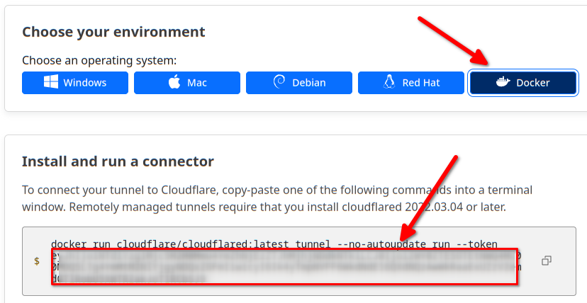
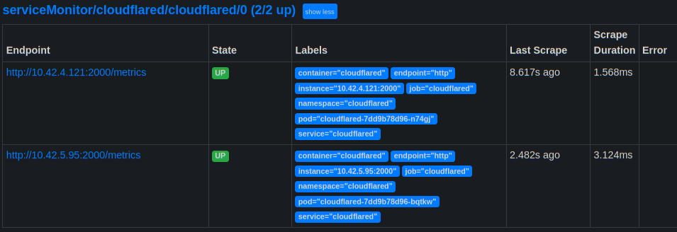

# Cloudflare Tunnel - Enable Internet Access without Public IP address

Cloudflare Tunnel provides you with a secure way to connect your resources to Cloudflare without a publicly routable IP address. With Tunnel, you do not send traffic to an external IP — instead, a lightweight daemon in your infrastructure (cloudflared) creates outbound-only connections to Cloudflare’s global network. Cloudflare Tunnel can connect HTTP web servers, SSH servers, remote desktops, and other protocols safely to Cloudflare.

IMPORTANT: _This does not cover any steps needed to create, configure or secure a Cloudflare tunnel. That is beyond the scope of this document.  Once you have created your tunnel and have a tunnel token, then this can be used to establish the outbound connection between Kubernetes and Cloudflare._

[Return to Application List](../)

---

* Helm based ArgoCD application deployment
* Uses Bernd Schorgers's fantastic [common template](https://bjw-s.github.io/helm-charts/docs/)
  * Allows this docker container to be easily adapted to a Helm Chart
* Two pod Highly Available Deployment
* No persistent storage required
* Only a single secret needs to be configure for the tunnel token
* Prometheus metrics and Service Monitor is enabled by default

The docker application for the Cloudflare Tunnel is named `cloudflared`,

---

Review file `cloudflared-tunnel-argocd-helm/applications/cloudflared.yaml`

* Define the ArgoCD project to assign this application to
* ArgoCD uses `default` project by default

  ```yaml
  spec:
    project: default
  ```

* This ArgoCD application defaults to the `cloudflared` namespace.  To use an alternative namespace update:

  ```yaml
  destination:
    server: https://kubernetes.default.svc
    namespace: cloudflared
  ```

  * And update file 
Review file `cloudflared-tunnel-argocd-helm/namespaces/cloudflared.yaml` to match:

  ```yaml
  ---
  apiVersion: v1
  kind: Namespace
  metadata:
    name: cloudflared
  ```

---

Review file `cloudflared-tunnel-argocd-helm/workloads/values.yaml`

* The service `main` is only needed for the Prometheus serviceMonitor to scrape metrics. If you do not wish to enable the service monitor then this can be disabled.

  ```yaml
  service:
    main:
      enabled: true
      ports:
        http:
          port: &port 2000
  ```

  * NOTE: Cloudflared does not use an ingress.

* The serviceMonitor defines the port to scrape and frequency to scrape metrics. If you do not wish to enable the service monitor then this can be disabled.

  ```yaml
  serviceMonitor:
    main:
      enabled: true
      endpoints:
        - port: http
          interval: 15s
          scrapeTimeout: 10s
          path: /metrics
  ```

---

## Initial Configuration

The only configuration required is to create a secret named `cloudflared-secret` which holds the value of the `CLOUDFLARED_TOKEN`.

* The `CLOUDFLARED_TOKEN` is provided to you at the time the tunnel is created. (Only a single tunnel is needed to link your Kubernetes to Cloudflare.)
* The token will be presented to you in a screen such as the following.  Select the `[ Docker ]` example and your token will be after the keyword `--token`:



* Once you have the cloudflared tunnel token, you will need to base64 encode the token for use within a Kubernetes secret:

  ```shell
  echo -n "..token goes here..." | base64

  T01HLiBEaWQgeW91IHJlYWxseSB0aGluayBJIHdvdWxkIHB1dCBteSB0b2tlbiBoZXJlPyBsb2x6IC0gdGhhbmtzIGZvciBjaGVja2luZy4gRW5qb3kgdGhlIHJlc3Qgb2YgeW91ciBkYXku
  ```

* Then place the base64 encoded token into a secret:

  ```yaml
  ---
  apiVersion: v1
  kind: Secret
  metadata:
    name: cloudflared-secret
    namespace: cloudflared
  type: Opaque
  data:
    CLOUDFLARED_TOKEN: T01HLiBEaWQgeW91IHJlYWxseSB0aGluayBJIHdvdWxkIHB1dCBteSB0b2tlbiBoZXJlPyBsb2x6IC0gdGhhbmtzIGZvciBjaGVja2luZy4gRW5qb3kgdGhlIHJlc3Qgb2YgeW91ciBkYXku
  ```

* Apply the secret or convert to a sealed secret or process as you would any other secret to the respective namespace (`cloudflared` by default):

  ```shell
  $ kubectl get secrets -n cloudflared

  NAME                 TYPE     DATA   AGE
  cloudflared-secret   Opaque   1      22h
  ```

* After the secret is deployed, you can deploy Cloudflare Tunnel application.  Within ArgoCD will resemble:


* Cloudflare's Tunnel Dashboard will show status `Healthy` once your deployment has successfully established a connection:


---

## Prometheus Metrics

By default the Prometheus serviceMonitor is enabled as documented above.  Confirm Prometheus is able to scape the number of defined pods (2 by default).

* Prometheus Web Interface > Status > Targets:



* Metrics should become available within a few seconds:


---

## Grafana Dashboard

* Grafana dashboard number `18020` is basic yet functional for showing the Tunnel metrics dashboard:


[Return to Application List](../)
